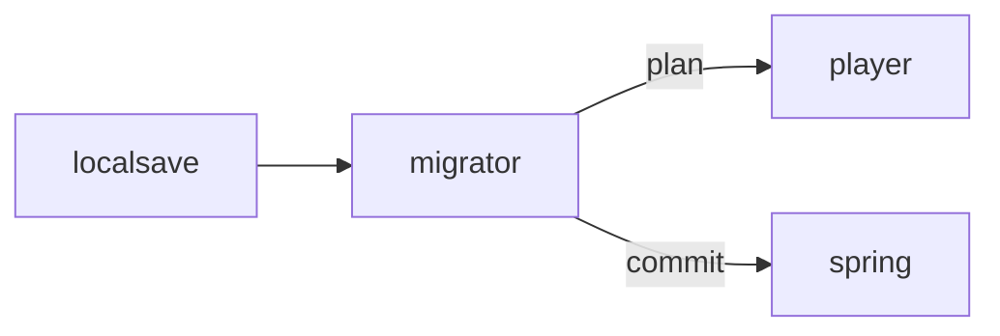

# Migrator

**Save Migrator** — A planned save-migration tool for reconciling local pet care with cloud identity.

Part of [ComputerPets](https://github.com/RicheyWorks/computerpets). Map: [computerpets-ecosystem](https://github.com/RicheyWorks/computerpets-ecosystem).

[Status](#status) · [Contract](docs/CONTRACT.md) · [Contributor start](#contributor-start) · [Ecosystem](https://github.com/RicheyWorks/computerpets-ecosystem)

| Project | At a glance |
| --- | --- |
| Status | Design scaffold; not runnable yet |
| License | MIT |
| First pet | [Flagship start guide](https://github.com/RicheyWorks/computerpets/blob/main/docs/START-HERE.md) |

## Status

This repository contains a [contract](docs/CONTRACT.md) and a [source placeholder](src/main/java/com/enterprisepet/migrator/package-info.java). It has no runnable application, build manifest, automated tests, or CI workflow.

The experience, interfaces, integrations, and safeguards below are **implementation plans**, not supported features. The first implementation slice defines the initial contribution target.

## Planned role

Rui already walks with no account. When a player later links Steam or a wallet, Migrator merges the offline care history instead of minting a second Rui.

For the desktop pet, start with the [flagship guide](https://github.com/RicheyWorks/computerpets/blob/main/docs/START-HERE.md).

## Intended audience

Players who met Rui offline and later linked Steam or a wallet.

## Out of scope

Not a second mint. Two Ruis is a conflict plan, never an auto-legendary.

## Proposed integration



## Planned stack

Java 21 · CLI (picocli) · local JSON/SQLite overlay saves · Spring import API · dry-run diffs

GroupId / namespace: `com.enterprisepet.migrator`  
Proposed listen surface: `CLI`

## Proposed contract

### Data

`LocalSave(path, petId, vitals) · Plan(create[], merge[], conflict[]) · Merge(winner=localCare+cloudIdentity)`

### Surface

- CLI: migrator scan — find local saves
- CLI: migrator plan — diff vs cloud
- CLI: migrator apply --dry-run|--commit
- POST /v1/import — authenticated merge

### Planned safeguards

Conflict (two Ruis) → stop and show plan, never auto-mint. Cloud 401 → leave local untouched. Partial apply → transaction per pet.

## First implementation slice

Initial implementation target:

**`migrator scan` / `plan` / `apply --dry-run` against local overlay saves.**

Acceptance targets: Conflict stops. 401 leaves local untouched. Transaction per pet.

## Planned environment

`API_BASE`, `PLAYER_TOKEN`

Never commit secrets. Never put Steam or chain keys in the overlay.

## Related projects

- [computerpets](https://github.com/RicheyWorks/computerpets) desktop local store
- [computerpets](https://github.com/RicheyWorks/computerpets) Spring backend
- [computerpets-ledger](https://github.com/RicheyWorks/computerpets-ledger)
- [computerpets-minter](https://github.com/RicheyWorks/computerpets-minter)

## Layout

```
computerpets-migrator/
  README.md           this file
  LICENSE             MIT
  docs/CONTRACT.md    the same contract, frozen for implementers
  src/                implementation lands here
```

## Contributor start

With Git and PowerShell, clone the scaffold and read its contract and source marker:

```powershell
git clone https://github.com/RicheyWorks/computerpets-migrator.git
Set-Location computerpets-migrator
Get-Content .\docs\CONTRACT.md
Get-Content .\src\main\java\com\enterprisepet\migrator\package-info.java
```

Start with the [first implementation slice](#first-implementation-slice). Add the minimum project setup and tests needed for that slice, then document verified run commands. The proposed stack above is a design choice; there is no install or launch command for this checkout yet.

## Links

- Flagship: [RicheyWorks/computerpets](https://github.com/RicheyWorks/computerpets)
- This repo: [RicheyWorks/computerpets-migrator](https://github.com/RicheyWorks/computerpets-migrator)
- Map: [RicheyWorks/computerpets-ecosystem](https://github.com/RicheyWorks/computerpets-ecosystem)
- Contract file: [docs/CONTRACT.md](docs/CONTRACT.md)

## License

MIT. See [LICENSE](LICENSE).

---

*Two hundred ten living kinds. Keep them so a line does not go quiet.*
