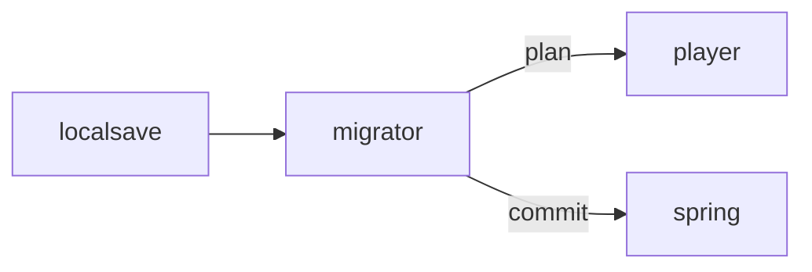

# Migrator

**Save Migrator** — Converts local offline saves into cloud-synced backend data without duplicating pets.

Part of [ComputerPets](https://github.com/RicheyWorks/computerpets). Map: [computerpets-ecosystem](https://github.com/RicheyWorks/computerpets-ecosystem).

| | |
| --- | --- |
| Status | Design scaffold — contract frozen, implementation next |
| License | MIT |
| First pet | Still [Rui on the desktop](https://github.com/RicheyWorks/computerpets/blob/main/docs/START-HERE.md). This organ is optional. |

## The job

Rui already walks with no account. When a player later links Steam or a wallet, Migrator merges the offline care history instead of minting a second Rui.

The flagship overlay already puts a living sticker on the real desktop (Rui first, 210 kinds). Migrator does not replace that. It is one organ.

## Who uses it

Players who met Rui offline and later linked Steam or a wallet.

## What it is not

Not a second mint. Two Ruis is a conflict plan, never an auto-legendary.

## Architecture



## Stack

Java 21 · CLI (picocli) · local JSON/SQLite overlay saves · Spring import API · dry-run diffs

GroupId / namespace: `com.enterprisepet.migrator`  
Default listen: `CLI`

## Contract

### Data

`LocalSave(path, petId, vitals) · Plan(create[], merge[], conflict[]) · Merge(winner=localCare+cloudIdentity)`

### Surface

- CLI: migrator scan — find local saves
- CLI: migrator plan — diff vs cloud
- CLI: migrator apply --dry-run|--commit
- POST /v1/import — authenticated merge

### Failure doctrine

Conflict (two Ruis) → stop and show plan, never auto-mint. Cloud 401 → leave local untouched. Partial apply → transaction per pet.

## First slice

Build this and stop. Do not boil the ocean.

**`migrator scan` / `plan` / `apply --dry-run` against local overlay saves.**

You know it works when: Conflict stops. 401 leaves local untouched. Transaction per pet.

## Environment

`API_BASE`, `PLAYER_TOKEN`

Never commit secrets. Never put Steam or chain keys in the overlay.

## Neighbors

- computerpets desktop local store
- computerpets Spring backend
- computerpets-ledger
- computerpets-minter

## Layout

```
computerpets-migrator/
  README.md           this file
  LICENSE             MIT
  docs/CONTRACT.md    the same contract, frozen for implementers
  src/                implementation lands here
```

## Run (Windows)

PowerShell, from this folder, after the flagship helpers (Git, Node LTS 22+, JDK 21 as needed):

```powershell
mvn -q -DskipTests package; java -jar target/migrator.jar scan
```

You do not need this service to meet Rui. The [flagship start-here](https://github.com/RicheyWorks/computerpets/blob/main/docs/START-HERE.md) is still the first pet.

## Links

- Flagship: [RicheyWorks/computerpets](https://github.com/RicheyWorks/computerpets)
- This repo: [RicheyWorks/computerpets-migrator](https://github.com/RicheyWorks/computerpets-migrator)
- Map: [RicheyWorks/computerpets-ecosystem](https://github.com/RicheyWorks/computerpets-ecosystem)
- Contract file: [docs/CONTRACT.md](docs/CONTRACT.md)

## License

MIT. See [LICENSE](LICENSE).

---

*Two hundred ten living kinds. Keep them so a line does not go quiet.*
